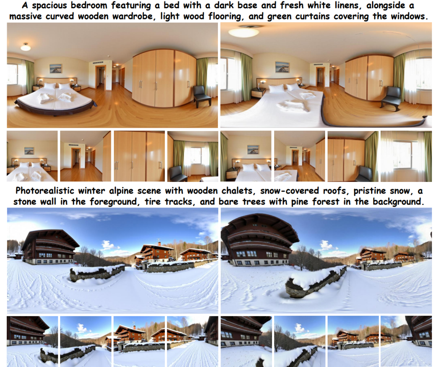
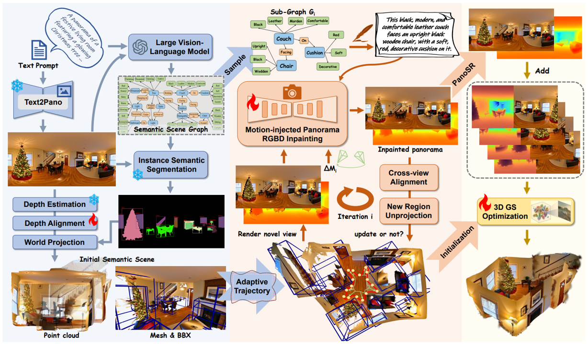
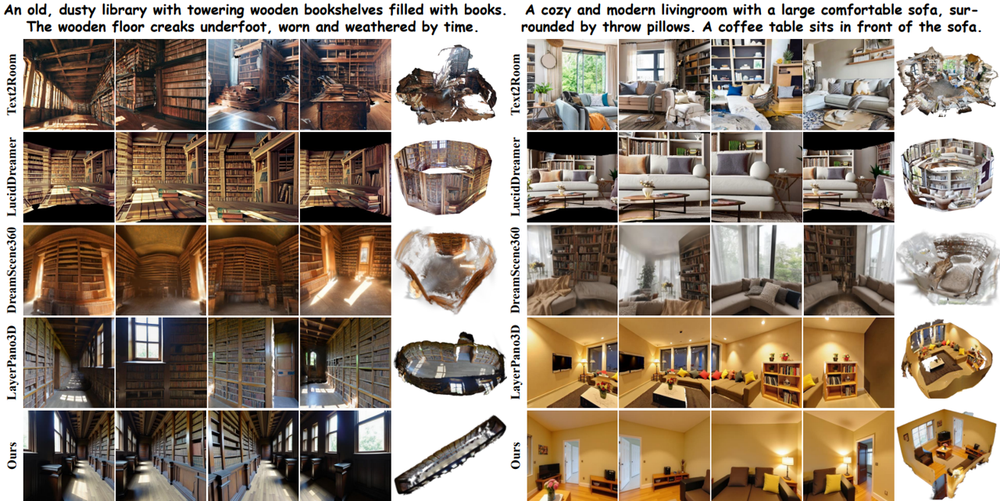
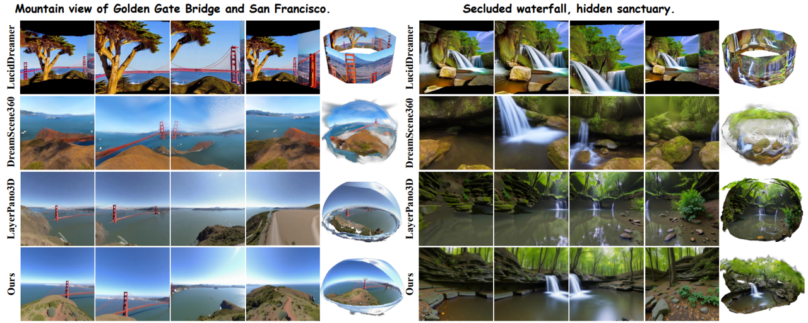

<div align="center">

# RoamScene3D

### Immersive Text-to-3D Scene Generation via Adaptive Object-aware Roaming

**Jisheng Chu**, **Wenrui Li**, **Rui Zhao**, **Wangmeng Zuo**, **Shifeng Chen**, **Xiaopeng Fan**

[](https://arxiv.org/pdf/2601.19433)
[](https://github.com/JS-CHU/RoamScene3D)
[](https://github.com/JS-CHU/RoamScene3D)

</div>

<p align="center">
  
</p>

## Abstract

RoamScene3D is a text-to-3D scene generation framework designed for immersive panoramic scene synthesis. Instead of relying on fixed or randomly perturbed camera trajectories, our method reasons about semantic object relations and explores the scene with an adaptive object-aware roaming strategy. Starting from an initial RGBD panorama, RoamScene3D constructs a semantic scene graph, plans a closed camera trajectory around salient objects, and applies a motion-injected panorama inpainting model to synthesize consistent novel views under camera motion. The generated observations are then fused into a panoramic 3D Gaussian Splatting representation, producing photorealistic and spatially coherent indoor and outdoor scenes.

## Framework Overview

<p align="center">
  
</p>

Given a text prompt, RoamScene3D first initializes the scene with a generated RGBD panorama and projects it into a coarse 3D representation. A large vision-language model is used to build a semantic scene graph, which identifies salient objects and their relations. Based on this structure, the method plans an adaptive closed roaming trajectory and synthesizes consistent novel panoramas with a motion-injected RGBD inpainting model. Finally, all observations are fused through 3D Gaussian Splatting optimization to obtain an immersive 3D scene representation.

## Qualitative Results

### Indoor Scenes

<p align="center">
  
</p>

### Outdoor Scenes

<p align="center">
  
</p>

## Videos

<table>
  <tr>
    <td align="center"><video src="assets/video0.mp4" controls muted playsinline width="100%"></video></td>
    <td align="center"><video src="assets/video1.mp4" controls muted playsinline width="100%"></video></td>
    <td align="center"><video src="assets/video2.mp4" controls muted playsinline width="100%"></video></td>
  </tr>
  <tr>
    <td align="center"><video src="assets/video3.mp4" controls muted playsinline width="100%"></video></td>
    <td align="center"><video src="assets/video4.mp4" controls muted playsinline width="100%"></video></td>
    <td align="center"><video src="assets/video5.mp4" controls muted playsinline width="100%"></video></td>
  </tr>
  <tr>
    <td align="center"><video src="assets/video6.mp4" controls muted playsinline width="100%"></video></td>
    <td align="center"><video src="assets/video7.mp4" controls muted playsinline width="100%"></video></td>
    <td align="center"><video src="assets/video8.mp4" controls muted playsinline width="100%"></video></td>
  </tr>
</table>

## Getting Started

This repository currently runs with two conda environments:

- `roamscene3d` for roaming, segmentation, inpainting, and 3DGS construction
- `layerpano3d` for the panorama super-resolution stage in `pasd/panoSR.py`

### Prepare Inputs

Organize the inputs with a shared `scene_name`:

```text
input/
├── scene_panoramas/
│   └── <scene_name>.png
├── scene_graphs/
│   └── <scene_name>.json
└── Camera_Trajectory/
    └── *.txt
```

### Main Environment

```bash
conda create -n roamscene3d python=3.9 -y
conda activate roamscene3d

pip install torch torchvision torchaudio --index-url https://download.pytorch.org/whl/cu118
pip install numpy scipy tqdm imageio imageio-ffmpeg
pip install transformers diffusers accelerate safetensors einops kornia
pip install open_clip_torch timm xformers
```

### Super-resolution Environment

```bash
conda create -n layerpano3d python=3.9 -y
conda activate layerpano3d

pip install torch torchvision --index-url https://download.pytorch.org/whl/cu118
pip install numpy scipy tqdm imageio
pip install transformers diffusers accelerate safetensors timm xformers
```

### Checkpoints

Please prepare the required weights for the main pipeline and the PASD super-resolution module. The current code path expects at least:

- `checkpoints/pasd/stable-diffusion-v1-5`
- `checkpoints/pasd/checkpoint-100000`
- optional `checkpoints/pasd/lcm-lora-sdv1-5`
- optional `checkpoints/personalized_models`

For the SR stage and some dependency details, the setup is closest to:

- [LayerPano3D](https://github.com/3DTopia/LayerPano3D)
- `pasd/panoSR.py`

## Quick Start

Run the full pipeline with:

```bash
bash run.sh <scene_name>
```

The script executes the following stages:

```bash
conda activate roamscene3d
python roaming.py --scene_name <scene_name>

conda activate layerpano3d
python ./pasd/panoSR.py --inputs_dir "./output/<scene_name>" \
    --decoder_tiled_size 448 \
    --encoder_tiled_size 4096 \
    --num_inference_steps 20 \
    --latent_tiled_size 128 \
    --latent_tiled_overlap 4

conda activate roamscene3d
python creating.py --scene_name <scene_name>
```

If needed, you can also set:

```bash
export HF_ENDPOINT=https://hf-mirror.com
```

## Acknowledgements

This project is related to and inspired by several panoramic and text-to-3D scene generation works, including:

- [LayerPano3D](https://github.com/3DTopia/LayerPano3D)
- [PeRF](https://github.com/perf-project/PeRF)
- [Pano2Room](https://github.com/TrickyGo/Pano2Room)
- [DreamScene360](https://github.com/ShijieZhou-UCLA/DreamScene360)


We also thank the open-source community for making panoramic generation, segmentation, inpainting, depth estimation, and Gaussian Splatting research more accessible.

## Citation

If you find this project helpful, please consider citing:

```bibtex
@article{chu2026roamscene3d,
  title={RoamScene3D: Immersive Text-to-3D Scene Generation via Adaptive Object-aware Roaming},
  author={Chu, Jisheng and Li, Wenrui and Zhao, Rui and Zuo, Wangmeng and Chen, Shifeng and Fan, Xiaopeng},
  journal={arXiv preprint arXiv:2601.19433},
  year={2026}
}
```
